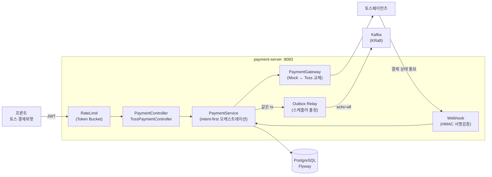
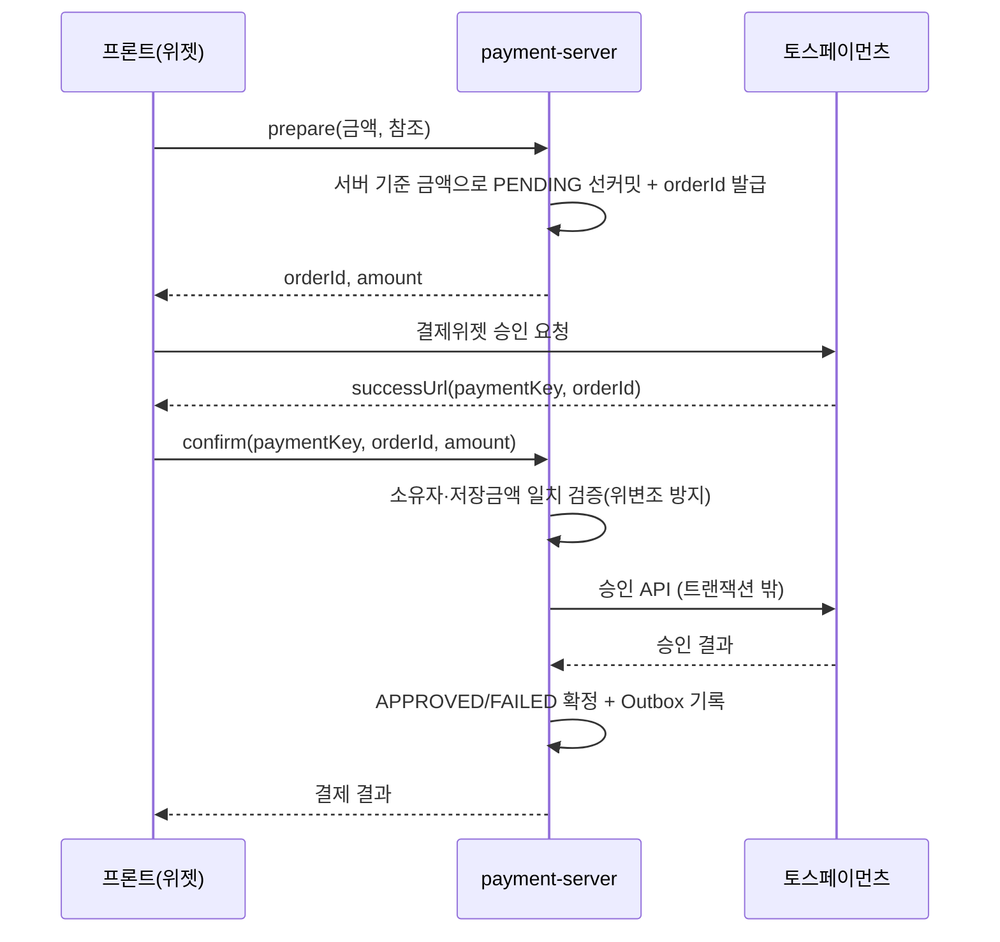

# 학꾸 (Hakku) — 결제·스토리지 보안·챗봇 파트

> 이 저장소는 SSAFY 팀 프로젝트 **[학꾸(Hakku)](https://github.com/hakku-ssafy/hakku)** 의 fork로,
> **김해찬**([@k-haechan](https://github.com/k-haechan))이 설계·리뷰를 주도한 영역을 중심으로 재정리한 문서입니다.
> 팀 전체 아키텍처(AI 진단 파이프라인·벤치마크 등)는 [원본 팀 README](README.team.md) 또는
> [원본 저장소](https://github.com/hakku-ssafy/hakku)를 참고하세요.

**학꾸**는 AI 퍼스널컬러 진단을 기반으로 꾸미기 아이템을 개인화 추천하는 커머스·커뮤니티 플랫폼입니다.
Nginx 뒤에 6개 애플리케이션 서비스가 독립 실행되는 폴리글랏 마이크로서비스 구조이며,
저는 그중 **결제 시스템, 서비스 분리에 따른 보안 설계, AI 챗봇의 뼈대, 팀 협업 인프라**를 맡았습니다.

---

## 협업 방식 — 페어프로그래밍 기반

이 파트의 상당 부분은 팀원 **천창현**(`rearleg`)과의 **페어프로그래밍**으로 진행했습니다.
당시 Claude 토큰이 넉넉하지 않아, 한 사람이 모든 코드를 치기보다 **역할을 나눠 개발을 끌고 가는 방식**을 택했습니다.

제가 맡은 역할은 **백엔드 아키텍처 리뷰와 고도화 방향 제시, 그리고 보안 취약점 점검**이었습니다.
"이 구조에서는 어떤 실패·공격이 가능한가, 어떻게 막을 것인가"를 짚고 그 개선 방향을 프롬프트로 구체화해,
창현이형의 Claude 세션을 통해 실제 구현을 이어가는 형태로 협업했습니다.
결제 서버처럼 제가 직접 커밋한 영역도 있고, 스토리지 서버처럼 방향과 보안 설계로 기여한 영역도 있습니다.

> 코드 곳곳의 `M-*` 주석은 이런 리뷰 과정에서 도출된 보안·신뢰성 개선 지점을 표시한 흔적입니다.

---

## 내가 주도한 영역

| 영역 | 역할 | 스택 | 핵심 |
|------|------|------|------|
| **결제 서버** `payment-server` | 설계·구현 | Spring Boot 4 · Java 17 · Kafka · Flyway | 토스페이먼츠 연동 + **결제 신뢰성 설계**(Outbox·멱등성·웹훅 서명검증·레이트리밋), TDD |
| **스토리지 서버 분리·보안** `storage-server` | 아키텍처 방향 제시 · 보안 설계 | Go | Native 언어 분리 판단 + **서비스 분리 보안 위협을 JWT로 차단** |
| **AI 챗봇 서버** `chatbot-server` | 초기 구축 (0→1) | FastAPI · OpenAI · Vue 3 | FastAPI 스캐폴드 + 프론트 챗봇 UI + Nginx SSE 라우팅 |
| **협업 인프라** `.github/` | 팀 표준 수립 | GitHub | 이슈·PR 템플릿 |

---

## 1. 결제 서버 (`payment-server`)

### 문제 정의

결제는 "토스 API를 호출한다"가 어려운 게 아니라, **호출 도중 무엇이든 실패할 수 있다**는 게 어렵습니다.

- PG 과금은 성공했는데 우리 DB 커밋 직전에 죽으면? → 돈은 빠졌는데 주문은 없음
- 사용자가 결제 버튼을 두 번 누르면? → 이중 결제
- 결제 완료 이벤트를 다른 서비스(포인트 적립 등)에 어떻게 **유실 없이** 전달하나?
- 위조된 웹훅이 "결제 성공"이라고 거짓말하면?

이 실패 시나리오들을 정리하고, 각각에 대한 방어를 코드로 못박는 방향으로 결제를 **독립 서버로 분리**했습니다.

### 아키텍처



### 결제 신뢰성 설계 (핵심)

각 방어는 실제 코드 주석에 근거가 남아 있습니다.

**① Intent-first + 멱등성 — 이중 결제 차단**
`idempotency_key`(토스 흐름에선 서버 생성 `orderId`)에 UNIQUE 제약을 걸고, 과금 **전에** PENDING 의도를 먼저 커밋합니다.
동시에 두 번 눌러도 레이스 패자는 UNIQUE 위반으로 걸러져 **승자의 결제를 재조회**합니다. 같은 키·다른 금액이면 409로 거부.

**② PG 호출은 트랜잭션 밖에서 — 커밋-실패 갭 봉합**
블로킹 I/O(PG API) 동안 DB 커넥션을 붙잡지 않도록 과금을 트랜잭션 밖에서 호출합니다.
과금 호출이 실패/타임아웃이면 **절대 롤백하지 않고** PENDING을 유지 — 실제 과금 여부가 불명이므로 웹훅/정산이 최종 상태를 확정합니다.

**③ 낙관적 락(`@Version`) — 동기 정산 vs 웹훅 정산 충돌 해소**
동기 응답과 웹훅이 같은 결제를 동시에 정산하려 하면 낙관적 락 충돌 → 1회 재시도 → 이미 종료 상태가 보여 **멱등 no-op**으로 확정 결과 반환.

**④ 트랜잭셔널 Outbox — 이벤트 유실 0**
결제 상태 변경과 "발행할 이벤트"를 **같은 트랜잭션**으로 DB에 기록하고, 별도 릴레이 워커가 폴링해 Kafka로 발행(`acks=all`, 멱등 producer).
브로커 ack 확인 후에만 SENT 전이(at-least-once). **poison 메시지 격리**: 반복 실패 레코드는 DEAD로 빼내 뒤 이벤트를 막지 않도록 했습니다.

**⑤ 웹훅 서명 검증 — 위조 통보 차단**
웹훅은 서명이 곧 인증. raw 본문의 HMAC-SHA256을 **상수시간 비교**(타이밍 공격 방지)하고, 32바이트 미만 약한 키는 부팅 시 fail-fast.

**⑥ Token Bucket 레이트리밋 + JWT 인증**
결제 엔드포인트에 토큰버킷 레이트리밋을 필터로 적용하고 Spring Security + JWT로 요청 주체를 검증합니다.

### 토스 결제위젯 흐름 (prepare → confirm)



`orderId`를 서버가 생성해 멱등 키로 그대로 쓰기 때문에, 클라이언트 멱등키 충돌·이중 INSERT 레이스가 **구조적으로** 발생하지 않습니다.
confirm 단계에서 저장 금액 vs 토스 반환 금액을 대조해 **금액 위변조**를 막습니다.

### 테스트 (TDD)

RED(실패 테스트) → GREEN(구현) 순서로 커밋을 남겼고, 결제 도메인 20여 종의 테스트 클래스로 커버합니다 —
도메인/상태, 멱등·동시성 API, Outbox 릴레이, 웹훅 서명·JWT·레이트리밋 등 신뢰성 경로를 각각 검증합니다.

---

## 2. 스토리지 서버 분리 & 보안 (`storage-server`)

이미지 입출력을 담당하던 스토리지 로직을 별도 서비스로 떼어내는 과정에서, 두 가지를 함께 짚었습니다.

### ① "왜 Go 네이티브인가" — 분리 언어 선택

스토리지는 CPU 로직보다 **이미지 바이트를 그대로 넘기는 I/O 위주** 작업입니다.
이 특성에는 JVM보다 **Go 표준 라이브러리 기반의 가벼운 네이티브 서버**가 적합하다고 판단했고,
실제로 팀은 Spring 구현(`storage-server-spring`)과 벤치마크를 비교해 이 선택을 검증했습니다.
(비교 결과는 [팀 README](README.team.md)의 벤치마크 섹션 참고)

### ② 서비스를 나누면 생기는 보안 구멍 — JWT로 봉합

서비스를 분리하면, 원래 하나의 앱 안에 있던 접근 제어가 **네트워크 경계 밖으로 노출**됩니다.
특히 퍼스널컬러 **진단 결과 이미지**는 아무나 URL만 알면 받아갈 수 있으면 안 되는 민감 자원입니다.
그래서 스토리지 서버 자체에 인증 경계를 두도록 방향을 잡았습니다.

- **result 종류 이미지는 유효한 Bearer JWT(HS256)** 를 요구하고, **업로드한 본인만** 내려받을 수 있게 소유자 검증
- 액세스 토큰과 리프레시 토큰(24h, `type=refresh`)이 시크릿을 공유하더라도, **리프레시 토큰을 액세스 토큰으로 오용하지 못하도록** 구분
- `JWT_SECRET` 누락 시 result 이미지가 **무인증 공개**되는 무음 보안 구멍이 생기므로, 그 경우 **부팅을 중단**(fail-fast)하도록 설계 (`M-7`)

> 제가 전부 구현한 영역은 아닙니다. 다만 "왜 Go로 분리하는가"와 "분리하면 무엇이 위험해지는가"라는
> 두 결정의 방향을 제가 짚었고, 그 보안 설계(JWT 접근 제어)를 창현이형과 함께 코드로 옮겼습니다.

---

## 3. AI 챗봇 서버 (`chatbot-server`) — 0→1 구축

프로젝트의 AI 고객센터 챗봇을 **처음부터 세워** 이후 팀이 확장할 토대를 만들었습니다(이슈 #1).

- **백엔드**: FastAPI 스캐폴드 — `app/api/chat.py`, `services/chat_service.py`, `config.py`, `main.py`, Dockerfile, pytest 설정
- **프론트**: 챗봇 진입 UI — `ChatFab.vue`(플로팅 액션 버튼) + `ChatWindow.vue`(대화 창)
- **인프라**: Nginx `/chat/` 라우팅, docker-compose 서비스 등록, `.env.example`

> 이후 팀이 이 토대 위에 대화 기억(Redis)·상품 카드 임베딩·SSE 스트리밍을 얹어 "학꾸AI"로 발전시켰습니다.

---

## 4. 협업 인프라 (`.github/`)

팀의 이슈/PR 작성 표준을 세웠습니다.

- 이슈 템플릿: **기능 요청 / 버그 리포트 / 리팩터** (`.github/ISSUE_TEMPLATE/`)
- **Pull Request 템플릿** (`.github/PULL_REQUEST_TEMPLATE.md`)

---

## 기술 스택 (담당 영역)

| 구분 | 기술 |
|------|------|
| 결제 백엔드 | Spring Boot 4.0 · Java 17 · Spring Security · Data JPA · Kafka · Flyway · JJWT · PostgreSQL 16 · Redis 7 |
| 스토리지 | Go (표준 라이브러리) · JWT(HS256) |
| 챗봇 백엔드 | FastAPI · Python · OpenAI |
| 프론트 | Vue 3 · TypeScript · Tailwind |
| 인프라 | Docker Compose · Nginx · Kafka(KRaft) |

---

## 실행 (담당 서비스 기준)

```bash
# 1. 환경변수
cp .env.example .env
# 결제:   PAYMENT_WEBHOOK_SECRET(32B+), TOSS_SECRET_KEY
#         샌드박스 테스트 시 PAYMENT_TOSS_SECRET_KEY_VALIDATION_ENABLED=false
# 스토리지: JWT_SECRET(base64) — 미설정 시 result 이미지 보호를 위해 기동 중단
# 프론트:  토스 클라이언트키 VITE_TOSS_CLIENT_KEY (frontend/.env)
# 챗봇:   OPENAI_API_KEY, CHATBOT_MODEL(기본 gpt-4o)

# 2. 전체 스택 기동
docker compose up -d --build
#   프록시 http://localhost:19001
#   결제 API  /api/payments   (payment-server :8083)
#   스토리지  /storage/        (storage-server)
#   챗봇      /chat/ (SSE)     (chatbot-server)

# 3. 결제 서버 테스트
cd payment-server && ./gradlew test
```

---

## 원본 프로젝트

- 팀 저장소: <https://github.com/hakku-ssafy/hakku>
- 팀 전체 README(백업): [README.team.md](README.team.md)
