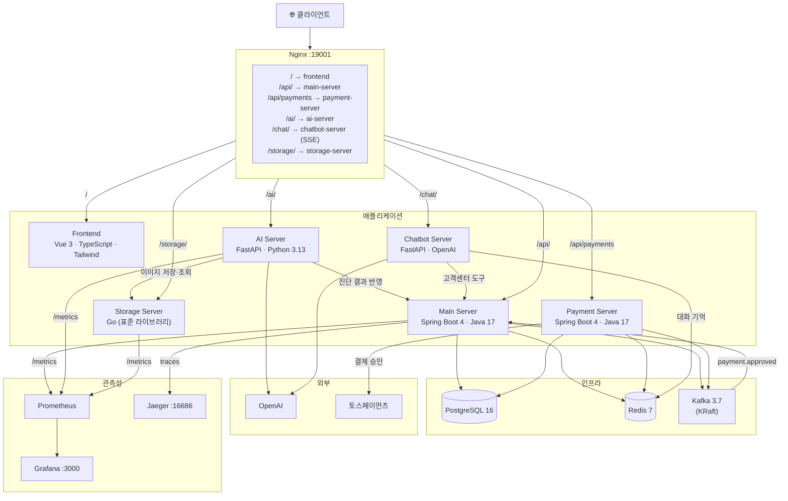
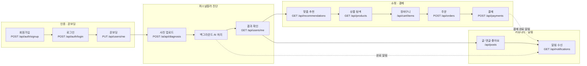
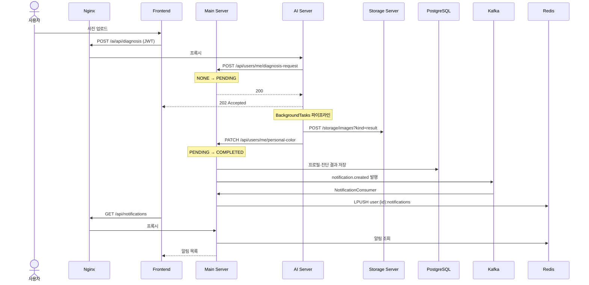
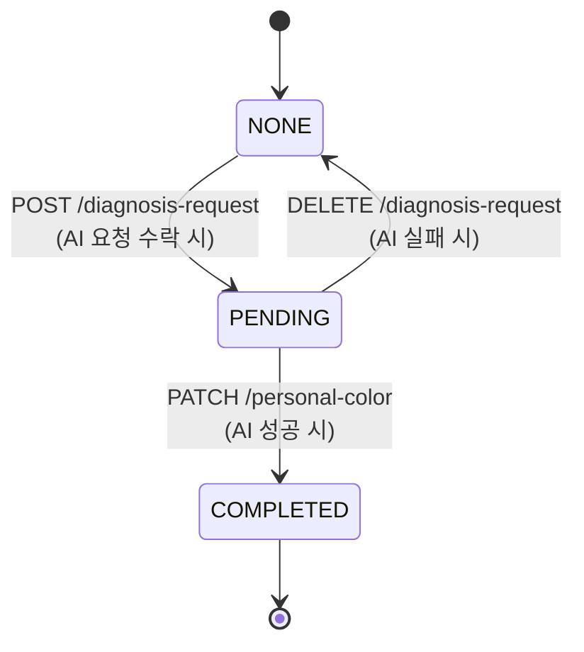
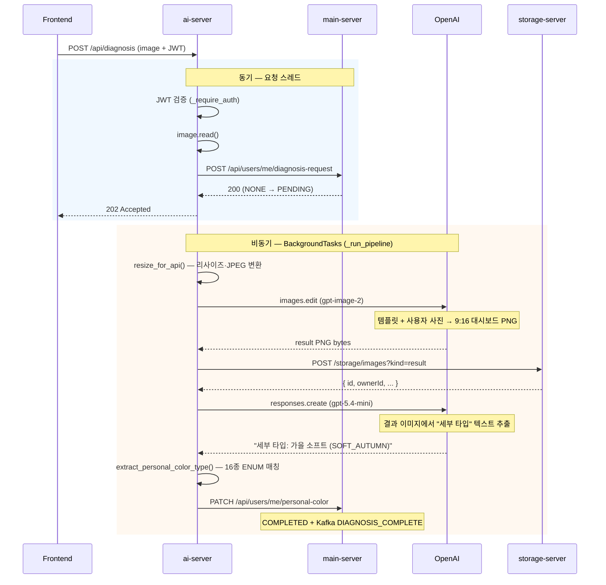

# 학꾸 (Hakku)

AI 퍼스널컬러 기반 꾸미기 아이템 추천 커머스·커뮤니티 플랫폼.

사용자가 얼굴 사진을 업로드하면 AI가 16종 퍼스널컬러를 진단하고, 진단 결과와 활동 이력을 바탕으로 스티커·뱃지·꾸미기 아이템을 개인화 추천한다. 토스페이먼츠 결제, AI 고객센터 챗봇, 마크다운 매거진, 학생증 자랑 커뮤니티까지 하나의 폴리글랏 마이크로서비스 스택으로 묶었다.

---

## 아키텍처

Nginx 리버스 프록시 뒤에 6개 애플리케이션 서비스가 독립 실행되는 폴리글랏 마이크로서비스 구조. 비즈니스 로직은 Spring(`main`·`payment`), AI 추론은 FastAPI(`ai`·`chatbot`), 이미지 입출력은 Go(`storage`)가 담당한다.



| 서비스 | 스택 | 책임 |
|---|---|---|
| `frontend` | Vue 3 + Vite + TypeScript + Tailwind + Pinia | 사용자 화면 |
| `main-server` | Spring Boot 4.0.6 (Java 17) | 회원·인증·커뮤니티·매거진·상품·주문·추천·알림 |
| `payment-server` | Spring Boot 4.0.6 (Java 17) | 토스페이먼츠 결제 승인·웹훅·Outbox 이벤트 발행 |
| `ai-server` | FastAPI (Python 3.13) | 퍼스널컬러 진단, OpenAI 연동 |
| `chatbot-server` | FastAPI (Python) + OpenAI | AI 고객센터 챗봇 (SSE 스트리밍·function-calling) |
| `storage-server` | Go 1.24 (표준 라이브러리) | 이미지 저장·서빙 |

**지원 인프라** — PostgreSQL · Redis · Kafka (KRaft) · Prometheus · Grafana · Jaeger

> `payment-server`는 `main-server`와 동일한 `hakku` PostgreSQL DB를 공유하되 Flyway 이력 테이블(`flyway_schema_history_payment`, baseline 0)을 분리해 마이그레이션이 충돌하지 않는다. 벤치마크용 `storage-server-spring`(Go 대조군)도 함께 제공한다.

---

## 핵심 서비스 흐름도

### 사용자 여정



| 단계 | 화면 | 핵심 API | 설명 |
|---|---|---|---|
| 1. 가입·로그인 | `/signup`, `/login` | `POST /api/auth/*` | JWT 발급, NORMAL은 온보딩 미완료 시 주요 페이지 접근 차단 |
| 2. 온보딩 | `/onboarding` | `PUT /api/users/me` | 선호 컬러·스타일 설정, `onboardingCompleted=true` |
| 3. 진단 요청 | `/diagnosis` | `POST /ai/api/diagnosis` | 즉시 202 반환, 백그라운드 처리 |
| 4. 결과 확인 | `/my` | `GET /api/users/me` | `personalColor`, `diagnosisImageUrl` 표시 |
| 5. 추천 | `/recommendations` | `GET /api/recommendations` | 퍼스널컬러·선호·행동 로그 기반 점수 산출 |
| 6. 상품·장바구니 | `/products`, `/cart` | `GET /api/products`, `/api/cart/items` | 상품 탐색, 장바구니 담기 |
| 7. 주문·결제 | `/order/new`, `/payments/checkout` | `POST /api/orders`, `POST /api/payments` | 토스페이먼츠 위젯으로 결제 승인, `payment.approved` 수신 시 주문 PAID 전이 |
| 8. 커뮤니티 | `/community` | `/api/posts`, `/api/comments` | 자유게시판 + 학생증 자랑(연관 상품 첨부), 댓글·좋아요 시 알림 발행 |
| 9. 알림 | `/notifications` | `GET /api/notifications` | Kafka→Redis 저장분을 폴링으로 조회 |

> 홈 매거진(`/magazine/:id`)과 AI 고객센터 챗봇(우측 하단 FAB → `/chat/stream`)은 위 여정과 별개로 거의 모든 페이지에서 접근할 수 있다.

### 서비스 간 상호작용

프론트엔드는 Nginx 경로별로 호출 대상이 갈린다 — 비즈니스 API는 **Main Server**(`/api/`), 결제는 **Payment Server**(`/api/payments`), 진단은 **AI Server**(`/ai/`), 챗봇은 **Chatbot Server**(`/chat/`, SSE), 이미지는 **Storage Server**(`/storage/`). 서버 간에는 AI Server가 처리 중 Main·Storage를, Chatbot Server가 고객센터 도구로 Main Server를, Payment Server가 토스페이먼츠를 HTTP로 호출하며, 결제 완료는 Kafka(`payment.approved`)를 통해 Main Server로 비동기 전파된다.



### 진단 상태 머신

사용자 프로필의 `diagnosisStatus`는 아래 상태 전이를 따른다.



### 알림 파이프라인

알림은 실시간 push 없이 **Kafka → Redis → 폴링** 구조로 동작한다.

| 트리거 | `NotificationType` | 수신자 |
|---|---|---|
| 진단 완료 | `DIAGNOSIS_COMPLETE` | 본인 |
| 댓글 작성 | `COMMENT` | 글 작성자 |
| 좋아요 | `LIKE` | 글 작성자 |
| 팔로우 | `FOLLOW` | 팔로우 대상 |
| 찜한 상품 좋아요 | `WISHLIST_LIKE` | 찜 작성자 |
| 결제 완료(주문) | `ORDER` | 구매자 |

결제(주문) 알림은 `payment-server`가 발행한 `payment.approved` 이벤트를 `main-server`의 `OrderPaymentConsumer`가 구독해, `referenceType="ORDER"`이고 주문이 실제로 `PAID`로 전이된 경우에만 발행한다(at-least-once 중복 수신 시 중복 알림 방지).

```
Producer (Main Server) → Kafka topic: notification.created
  → Consumer (NotificationConsumer) → Redis List: user:{userId}:notifications (최대 50건)
    → Frontend 폴링: GET /api/notifications
```

### 추천 점수 산출

`RecommendationScoreCalculator`가 아래 요소를 합산해 상품별 점수를 계산하고, 점수 구성 요소를 응답에 포함한다.

| 요소 | 설명 |
|---|---|
| 퍼스널컬러 일치도 | 사용자 16종 세부 타입 → 계절 단위 환원 후 상품 태그와 비교 |
| 선호 스타일·컬러 | 온보딩 시 설정한 `preferredStyles`, `preferredColors` |
| 행동 로그 | 클릭·찜·장바구니 등 최근 활동 |
| 상품 인기도 | 리뷰 평점·인기 지표 |

---

## AI 프로세스 흐름도

### 전체 파이프라인

사용자가 사진을 올리면 AI Server가 **슬롯 잠금 → 202 즉시 반환 → 백그라운드 처리** 순으로 동작한다. 페이지를 이탈해도 요청은 계속 처리되고, 완료 시 Kafka 알림이 발행된다.



### 단계별 처리 상세

| # | 단계 | 모듈 | 함수 | sync/async | 설명 |
|---|---|---|---|---|---|
| 1 | 슬롯 잠금 | `main_client` | `request_diagnosis_start()` | sync | 중복 요청 시 409 |
| 2 | 전처리 | `preprocess` | `resize_for_api()` | sync | 긴 변 1024px, RGBA→흰 배경, JPEG q=90 |
| 3 | 이미지 생성 | `generator` | `generate_analysis_image()` | async | gpt-image-2 `images.edit`, 1024×1824 |
| 4 | 결과 저장 | `storage` | `upload_result_image()` | async | `kind=result`, JWT→ownerId |
| 5 | 텍스트 추출 | `vision` | `extract_color_from_image()` | async | gpt-5.4-mini Responses API |
| 6 | ENUM 파싱 | `ocr` | `extract_personal_color_type()` | sync | 16종 퍼스널컬러 매칭 |
| 7 | 결과 반영 | `main_client` | `update_user_diagnosis()` | async | personalColor + resultImageUrl |

### OpenAI 모델 사용

| 모델 | API | 입력 | 출력 |
|---|---|---|---|
| `gpt-image-2` | `images.edit()` | 템플릿(`result1.png`) + 전처리 JPEG | 9:16 퍼스널컬러 대시보드 PNG |
| `gpt-5.4-mini` | `responses.create()` | 생성 PNG (base64) | `세부 타입: {한글명} ({ENUM})` 한 줄 |

### 16종 퍼스널컬러 추출 (OCR)

Vision API가 반환한 텍스트에서 `ocr.extract_personal_color_type()`이 아래 우선순위로 ENUM을 결정한다.

1. **직접 ENUM 매칭** — 괄호 안 코드 검색 (예: `SOFT_AUTUMN`)
2. **한글 라벨 매칭** — 16종 한글명 substring (가장 긴 키워드 우선)
3. **계절 → 톤 fallback** — 계절 키워드 확정 후 톤 키워드로 세부 타입 추론

| 계절 | 세부 타입 |
|---|---|
| 봄 | `LIGHT_SPRING`, `TRUE_SPRING`, `BRIGHT_SPRING`, `CLEAR_SPRING` |
| 여름 | `LIGHT_SUMMER`, `TRUE_SUMMER`, `SOFT_SUMMER`, `COOL_SUMMER` |
| 가을 | `SOFT_AUTUMN`, `TRUE_AUTUMN`, `DEEP_AUTUMN`, `MUTED_AUTUMN` |
| 겨울 | `BRIGHT_WINTER`, `TRUE_WINTER`, `DEEP_WINTER`, `CLEAR_WINTER` |

### 에러 처리

| 실패 지점 | 동작 |
|---|---|
| 슬롯 잠금 409 | 즉시 409 반환 (이미 진행 중·완료) |
| 파이프라인 예외 | `DELETE /api/users/me/diagnosis-request` → NONE 복구 |
| OCR 매칭 실패 (`None`) | 동일하게 NONE 복구, 사용자 재시도 가능 |

백그라운드 실패 시 클라이언트는 이미 202를 받은 상태이므로, 사용자는 프로필 폴링 또는 알림으로 결과를 확인한다.

---

## 주요 특징

### 이미지 트래픽 분리

Main Server는 이미지 바이트를 다루지 않는다. Nginx 레벨에서 라우팅이 분리되어 이미지 업로드·다운로드가 비즈니스 서버를 통과하지 않는다.

```
[진단] Frontend → Nginx → AI Server → (내부) Storage Server
[상품] Frontend → Nginx → Storage Server
```

### 퍼스널컬러 결과 이미지 접근 제어

AI가 생성한 퍼스널컬러 진단 결과 이미지(`kind=result`)는 JWT 인증을 통과한 본인만 다운로드할 수 있다.

- 업로드 시 사용자의 JWT를 Storage Server에 전달 → `ownerId`로 메타데이터에 저장
- 다운로드 시 Bearer 토큰 검증 + `sub` 클레임과 `ownerId` 일치 여부 확인 → 불일치 시 403
- `JWT_SECRET` 미설정 환경(로컬 개발)에서는 인증 없이 동작하고 경고 로그를 출력한다
- `raw` 종류 이미지(AI 처리용 원본)는 영향 없음

### 콘텐츠 기반 추천 엔진

퍼스널컬러 일치도, 선호 스타일 일치도, 최근 행동 로그(클릭·찜·장바구니), 상품 인기도·리뷰 점수를 합산해 점수를 산출한다. 점수 구성 요소를 분해해서 응답에 포함하므로 추천 이유를 설명할 수 있다.

### 토스페이먼츠 결제 + 트랜잭셔널 Outbox

결제는 별도 `payment-server`(Spring Boot 4, `:8083`)가 담당하며, **Intent → Charge → Settle** 3단계로 동작한다.

1. **Intent** — 결제를 `PENDING`으로 먼저 기록(별도 트랜잭션). `idempotencyKey` UNIQUE 제약으로 중복 요청을 막는다.
2. **Charge** — 트랜잭션 밖에서 토스페이먼츠 `POST /v1/payments/confirm`을 호출한다(네트워크 I/O 동안 DB 커넥션 점유 방지). `PaymentGateway` 추상화로 운영은 토스 클라이언트, 테스트는 `MockPaymentGateway`를 끼운다.
3. **Settle** — 낙관적 락(`@Version`)으로 `PENDING → APPROVED/FAILED` 전이와 Outbox 이벤트 기록을 **한 트랜잭션에서** 원자적으로 처리한다. 동기 요청 경로와 웹훅 경로가 동일한 `PaymentSettler`를 공유해 멱등하게 정산된다.

기록된 Outbox 이벤트는 스케줄러(`OutboxRelay`)가 폴링해 Kafka(`payment.approved`/`payment.failed`)로 at-least-once 발행한다(재시도 횟수 누적, 최대치 초과 시 `DEAD`로 격리). PG 웹훅(`POST /api/payments/webhooks/pg`)은 `PAYMENT_WEBHOOK_SECRET` 기반 HMAC-SHA256 서명을 상수시간 비교로 검증하고, `/api/payments/**`에는 사용자·IP별 토큰 버킷 레이트리밋이 걸린다. 부팅 시 `TossSecretKeyValidator`가 `test_` 샌드박스 키를 거부해(운영 기본 ON) 잘못된 키로 기동하지 못하게 막는다.

### AI 고객센터 챗봇

`chatbot-server`(FastAPI + OpenAI)는 우측 하단 FAB에서 열리는 **학꾸AI** 상담 챗봇이다.

- **SSE 스트리밍** — `POST /chat/stream`이 `text/event-stream`으로 토큰을 흘려보내고, Nginx는 `/chat/` 경로에서 `proxy_buffering off`로 그대로 전달한다.
- **1시간 대화 기억** — Redis Sorted Set(`chat:history:{user_id}`)에 메시지를 타임스탬프 점수로 저장하고, 1시간 윈도우를 벗어난 메시지는 정리한다. 새로고침하면 `GET /chat/history`로 복원한다.
- **function-calling 고객센터 도구** — LLM이 필요 시 `get_order_history`(주문 내역), `get_wishlist`(찜 목록), `recommend_products`(맞춤 추천)를 호출하며, 각 도구는 사용자 JWT를 그대로 들고 `main-server` API를 호출한다(최대 3라운드).
- **상품 카드 임베딩** — `recommend_products` 결과는 `{ "products": [...] }` SSE 이벤트로 내려보내 답변 본문과 함께 클릭 가능한 상품 카드로 렌더링한다. 답변은 마크다운으로 작성된다.

### 마크다운 매거진

큐레이션 카드를 대체한 콘텐츠 기능. `Magazine` 엔티티는 `kicker`·`title`·`subtitle`·`content`(마크다운)·`coverImageUrl`·`displayOrder`·`published`를 가진다. 공개 API는 `GET /api/magazines`(발행분만, `displayOrder` 정렬)·`GET /api/magazines/{id}`, 관리는 `ADMIN` 전용 `/api/admin/magazines` CRUD다. 마크다운 본문에 상품 링크(`/products/{id}`)를 한 줄로 두면 프론트(`/magazine/:id`)가 이를 감지해 넓은 상품 카드로 자동 임베드하고, 임베드 대상 상품 정보를 병렬로 가져온다.

### 커뮤니티 — 학생증 자랑

게시글(`Post`)은 `board`(`GENERAL`/`STUDENT_ID`)로 갈린다. 학생증 자랑 글은 `imageUrl`(쇼케이스 이미지)과 연관 상품(`productIds` → `relatedProducts`)을 첨부할 수 있다. `/community`는 자유게시판과 학생증 자랑 그리드 탭을 제공하고, 상세(`/community/:id`)에는 연관 상품 카드 섹션이 붙으며, 홈에도 학생증 자랑 이미지 그리드 섹션이 노출된다.

### Storage Server Go vs Spring 비교

Go 표준 라이브러리로 구현한 `storage-server`와 동일 API·JWT 정책을 제공하는 Spring Boot 구현체(`storage-server-spring`)를 병렬로 제공한다. 두 구현체 모두 `kind=result` 이미지에 대해 JWT Bearer 검증 및 `ownerId` 기반 다운로드 접근 제어를 적용한다.

## 벤치마크 결과

#### 공정 벤치마크 환경

이전 측정은 Go가 메인 compose 안에서 다른 서비스와 리소스를 공유하고 Spring은 거의 단독 환경이어서 결과가 왜곡되었다. 아래 조건으로 **격리된 공정 환경**을 구성해 재측정했다.

| 항목 | 값 |
|---|---|
| Compose | `compose/storage-bench.yml` |
| JWT | 동일 `JWT_SECRET` (양쪽 활성화) |
| 리소스 한도 | CPU 2코어, 메모리 512MB (각각) |
| 포트 | Go `8081`, Spring `8082` |
| 워크로드 | k6 — 실제 이미지(72KB~865KB) 업로드 → 다운로드 → 삭제 (`kind=raw`) |
| 스크립트 | `./scripts/benchmark-storage-fair.sh` |

```bash
# 공정 벤치 (권장)
VUS=20  DURATION=60s ./scripts/benchmark-storage-fair.sh
VUS=100 DURATION=60s ./scripts/benchmark-storage-fair.sh

# 전체 아키텍처 부하 (main-server 경유, 비교 참고용)
./scripts/benchmark-storage.sh
```


부하 시나리오: **20 VU = 평소**, **100 VU = 고부하**. Go 개선(%)은 Spring 대비 — 처리량은 높을수록, 업로드 지연은 낮을수록 유리하다.

**Go vs Spring (평소 · 20 VU)**

| 지표 | Spring | Go | Go 개선 |
|---|---:|---:|---:|
| 처리량 (req/s) | 939 | 3,610 | **+284%** |
| 업로드 avg | 21ms | 5ms | **+76%** |
| 업로드 p95 | 75ms | 15ms | **+80%** |
| 업로드 p99 | 86ms | 28ms | **+67%** |

**Go vs Spring (고부하 · 100 VU)**

| 지표 | Spring | Go | Go 개선 |
|---|---:|---:|---:|
| 처리량 (req/s) | 926 | 2,340 | **+153%** |
| 업로드 avg | 127ms | 43ms | **+66%** |
| 업로드 p95 | 479ms | 132ms | **+72%** |
| 업로드 p99 | 714ms | 225ms | **+68%** |

평소에도 Go가 처리량 **약 3.8배**, 업로드 p95 **약 80% 빠름**. 고부하에서도 Go 우위는 유지되나(처리량 +153%, 업로드 p95 +72%) Spring은 업로드 p95가 평소 대비 **6배** 늘어나 병목이 업로드에 집중된다. 차이의 주요 원인은 JWT가 아니라 런타임·프레임워크 비용이다.

> `kind=raw` 픽스처만 사용하므로 JWT 검증 경로는 벤치 부하에 포함되지 않는다. JWT 동작은 단위 테스트(`JwtValidatorTest`)로 검증한다.


### 관측성

세 백엔드 모두 `/metrics` 엔드포인트를 노출한다. Prometheus가 메트릭을 수집하고 Grafana 대시보드로 시각화한다.

| 대시보드 | URL | 내용 |
|---|---|---|
| Service Overview | http://localhost:3000/d/hakku-overview | 전체 서비스 HTTP·JVM |
| **Storage 벤치마크** | http://localhost:3000/d/hakku-storage-bench | Go vs Spring 처리량·P95·CPU·메모리 |

```bash
docker compose -f compose/obs.yml up -d   # Prometheus + Grafana + Jaeger
```

Jaeger(`http://localhost:16686`)는 기동 가능하나, Storage 서버에는 OpenTelemetry tracing이 아직 연동되지 않아 트레이스 데이터는 없다. Storage 성능 비교는 Grafana/Prometheus를 사용한다.

---

## 실행

### 데이터셋 준비

> [Google Drive — hakku_dataset.zip 다운로드](https://drive.google.com/file/d/1OtBROPRBg4sGTOoLM843mMl1klmXItge/view?usp=sharing)

다운로드 후 `data/` 디렉터리에 압축 해제한다.

### 환경변수 설정

```bash
cp .env.example .env
# 필수: POSTGRES_PASSWORD, JWT_SECRET, OPENAI_API_KEY
# 결제: PAYMENT_WEBHOOK_SECRET, TOSS_SECRET_KEY (샌드박스 테스트 시
#       PAYMENT_TOSS_SECRET_KEY_VALIDATION_ENABLED=false), 챗봇: CHATBOT_MODEL(기본 gpt-4o)
# 프론트 토스 결제위젯 클라이언트키는 frontend/.env 의 VITE_TOSS_CLIENT_KEY 에 설정한다
```

### 기동

```bash
# 전체 스택
docker compose up -d --build

# 관측성 스택 (선택)
docker compose -f compose/obs.yml up -d
```

Nginx는 host 포트 `19001`로 노출된다(운영은 앞단 Caddy가 `19001`로 프록시).

| 엔드포인트 | 주소 |
|---|---|
| 프론트엔드 | http://localhost:19001 |
| Main API | http://localhost:19001/api |
| 결제 API | http://localhost:19001/api/payments |
| AI API | http://localhost:19001/ai |
| 챗봇 (SSE) | http://localhost:19001/chat |
| Storage | http://localhost:19001/storage |
| Grafana | http://localhost:3000 |
| Jaeger | http://localhost:16686 |
